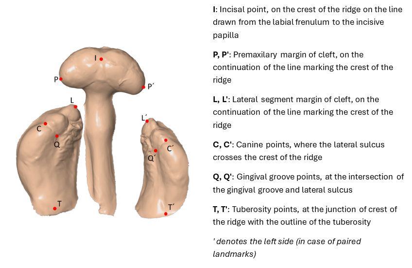

# CleftMeter

[](https://doi.org/10.5281/zenodo.16970749)
[](LICENSE.txt)

## Authors

- **Libor Borák, Ph.D.**  
  Assistant Professor, Institute of Solid Mechanics, Mechatronics and Biomechanics,  
  Faculty of Mechanical Engineering, Brno University of Technology, Brno, Czech Republic  

- **Petr Marcián, Ph.D.**  
  Assistant Professor, Institute of Solid Mechanics, Mechatronics and Biomechanics,  
  Faculty of Mechanical Engineering, Brno University of Technology, Brno, Czech Republic  

- **Olga Košková, Ph.D.**  
  Assistant Professor, Department of Burns and Plastic Surgery, University Hospital Brno  
  and Faculty of Medicine, Masaryk University, Brno, Czech Republic;  
  Cleft Center of the University Hospital Brno, Brno, Czech Republic  

Version: **1.0**  
Date: **2025**

---

## Table of Contents
1. [Introduction](#1-introduction)  
2. [Installation and System Requirements](#2-installation-and-system-requirements)  
3. [User Interface Overview](#3-user-interface-overview)  
4. [Core Workflow: A Step-by-Step Guide](#4-core-workflow-a-step-by-step-guide)  
  4.1 [Loading an STL Model](#41-loading-an-stl-model)  
  4.2 [Defining Anatomical Points](#42-defining-anatomical-points)  
  4.3 [Editing, Skipping, and Deleting Points](#43-editing-skipping-and-deleting-points)  
  4.4 [Saving Your Work](#44-saving-your-work)  
  4.5 [Loading Existing Work](#45-loading-existing-work)  
5. [Managing Measurements](#5-managing-measurements)  
  5.1 [Adding Custom Distances and Angles](#51-adding-custom-distances-and-angles)  
  5.2 [Visualizing and Removing Measurements](#52-visualizing-and-removing-measurements)  
6. [Anatomical Landmarks](#6-anatomical-landmarks)  
7. [Data Export for Analysis (e.g., in Excel)](#7-data-export-for-analysis-eg-in-excel)  
 

---

## 1. Introduction
CleftMeter is a specialized software tool designed for anthropometric analysis of 3D models, with a primary focus on maxillary arches in infants with cleft lip and palate. The application allows users to load a 3D model in the standard STL format, place a series of predefined anatomical landmarks, and automatically calculate distances and angles between them.  

The software provides a streamlined workflow for researchers and clinicians, enabling consistent and repeatable measurements for clinical assessment, treatment planning, and research studies.

---

## 2. Installation and System Requirements
CleftMeter is distributed in two formats to accommodate different user needs.

### a) Standalone Application (.exe)
This version is recommended for most users on the Windows operating system. It is a single executable file that runs directly without any prior setup.  
- **Installation:** No installation is needed. Simply download and run the `CleftMeter_v1.0.exe` file.  
- **Requirements:** A modern Windows operating system (Windows 10 or newer is recommended).  

### b) Python Script (.py)
This version is intended for developers or users on other operating systems (macOS, Linux) who are comfortable working with Python environments.  
- **Installation:**  
  1. Ensure you have Python (version 3.11 or newer) installed on your system.  
  2. This script requires several external libraries to function. You must install them into your Python environment. The required libraries are:  
     - **PySide6:** A framework for creating the graphical user interface (windows, buttons, lists).  
     - **NumPy:** A fundamental package for scientific computing, used for all mathematical operations with 3D coordinates.  
     - **VTK (The Visualization Toolkit):** A powerful library for 3D computer graphics, used to render the STL model and points.  
  3. You can install all these required libraries at once by running the following command in your terminal or command:  
     ```bash
     pip install PySide6 numpy vtk
     ```  
  4. Run the script from your terminal:  
     ```bash
     python CleftMeter_v1.0.py
     ```  

---

## 3. User Interface Overview
The main window of CleftMeter is divided into two primary sections: the **Control Panel** on the left and the **3D Viewport** on the right.


- **(A) 3D Viewport:** This is the main interactive window where your STL model is displayed. You can rotate, pan, and zoom the model here. In the top-left corner, a list of keyboard controls is always visible. In the top-right, the name of the loaded STL file is shown.  
- **(B) Control Panel:** Located on the left, this panel contains all the data and measurement tools.  
  - Points List: Displays the list of anatomical landmarks, their status (e.g., "define now", "skipped"), and their 3D coordinates once placed.  
  - Distances List: Shows the calculated distances. You can add new custom distances or remove existing ones using the Add and Remove Selected buttons.  
  - Angles List: Shows the calculated angles, with similar Add and Remove Selected functionality.  
  - Point Size Slider: Allows you to adjust the visual size of the points and their labels in the 3D viewport.  
- **(C) Main Toolbar:** A row of buttons at the bottom of the 3D viewport for file operations and view controls.  
- **(D) Prompt Bar:** A status bar located just above the Main Toolbar. It provides instructions and guides you on the next action to perform (e.g., "Define point I").  

---

## 4. Core Workflow: A Step-by-Step Guide
This section guides you through a typical measurement session.

### 4.1 Loading an STL Model
1. Launch the CleftMeter application.  
2. Click the **Open STL** button on the Main Toolbar.  
3. A file dialog will appear. Navigate to and select your `.stl` file.  
4. The model will load into the 3D Viewport. The application will automatically reset the camera to fit the model in the view.  

### 4.2 Defining Anatomical Points
After loading a model, the application enters point definition mode. The Prompt Bar will guide you to define the first point (e.g., "Define point I").  

1. Navigate the Model:  
   - Rotate: Hold the **left mouse button** and drag.  
   - Pan: Hold the **middle mouse button** (or **Shift + Left Mouse Button**) and drag.  
   - Zoom: Use the scroll wheel (or hold the right mouse button and drag).  
2. Enter Define Mode: Press and hold the **D** key on your keyboard. While this key is held down, the application is in "Define Point" mode.  
3. Place the Point: With the **D** key held, move your cursor over the 3D model and left-click on the precise location where you want to place the landmark.  
4. A red sphere and a text label for the point will appear on the model. The Points List will update with the coordinates, and the Prompt Bar will automatically advance to the next point in the sequence.  
5. Repeat this process for all required points.  


### 4.3 Editing, Skipping, and Deleting Points
You can modify points at any time.  

- **To Edit a Point:**  
  1. Press and hold the **E** key. The prompt will change to "Edit (select point in list)".  
  2. While holding **E**, click on the point you wish to edit in the Points List. It will be highlighted in green.  
  3. Release the **E** key. The prompt will now guide you to click a new position.  
  4. Press and hold **E** again, and left-click on the model to set the new location for the selected point.  

- **To Skip a Point:**  
  If you are prompted to define a point but cannot place it (e.g., the landmark is not visible or applicable), simply press the **N** key. The point's status will change to "skipped" in the Points List, and the application will move to the next point.  

- **To Delete a Point (Reset its status):**  
  1. Press and hold the **Delete** key. The prompt will change to "Delete (select point in list)".  
  2. While holding **Delete**, click on the point you wish to remove in the Points List.  
  3. The point's coordinates will be erased, and its status will be reset to "skipped".  

### 4.4 Saving Your Work
All placed points and custom measurements can be saved to a text file (`.txt`).  
1. Click the **Save** button on the Main Toolbar.  
2. The application will automatically save a `.txt` file in the same directory and with the same name as your loaded STL file. For example, if you loaded `patient_01.stl`, your work will be saved as `patient_01.txt`.  
3. If a file with that name already exists, you will be asked to confirm before overwriting it.  

### 4.5 Loading Existing Work
You can continue a previously saved session.  
1. Click the **Open Points** button.  
2. Select the `.txt` file you previously saved.  
3. The application will automatically find and load the associated `.stl` file (it must be in the same directory) and then load all the saved points and measurements.  

---

## 5. Managing Measurements
CleftMeter comes with a default set of distances and angles, but you can also define your own.  

### 5.1 Adding Custom Distances and Angles
1. Make sure you have at least two (for distances) or three (for angles) points defined.  
2. Under the **Distances** or **Angles** list, click the **Add** button.  
3. A dialog window will appear. Use the dropdown menus to select the points you want to use for the new measurement.  
   - **For a Point-to-Point Distance:** Select two points and leave the third dropdown as "NONE".  
   - **For a Point-to-Line Distance:** Select three points. The distance from the first point to the line formed by the second and third points will be calculated.  
   - **For an Angle:** Select three points. The angle will be measured at the second point selected (the vertex).  
4. Click **OK**. The new measurement will appear in the corresponding list.  


### 5.2 Visualizing and Removing Measurements
- **To Visualize:** Simply click on any distance or angle in its list. The corresponding points and a line (or lines) representing the measurement will be highlighted in the 3D Viewport.  
- **To Remove:** First, click on the measurement in the list to select it. Then, click the **Remove Selected** button. You will be asked to confirm the deletion.  


---

## 6. Anatomical Landmarks
CleftMeter is pre-configured with a set of landmarks commonly used in the analysis of maxillary arches in infants with clefts. The default landmarking scheme is based on the methodology described by Sekel et al.  

- **Default Landmarks:** I, P, P', L, L', C, C', Q, Q', T, T'  



For a detailed definition and clinical significance of each of these landmarks, users are advised to consult the following publications:  

- Seckel NG, van der Tweel I, Elema GA, Specken TF. *Landmark positioning on maxilla of cleft lip and palate infant--a reality?* Cleft Palate Craniofac J. 1995 Sep;32(5):434-41. doi: 10.1597/1545-1569_1995_032_0434_lpomoc_2.3.co_2. PMID: 7578209.  
- Košková O, Borák L, Urbanová W, Bryšová A, Nováková M, Richtrová M, Streit L, Štourač P, Marcián P. *Comparison of silicone impressions with intraoral 3D scans in newborns with cleft lip and palate.* J Prosthet Dent. 2025 Jul;134(1):275-282. doi: 10.1016/j.prosdent.2025.02.054. Epub 2025 Mar 27. PMID: 40148199.  

---

## 7. Data Export for Analysis (e.g., in Excel)
The `.txt` file saved by CleftMeter is formatted specifically to be easily imported into spreadsheet software like Microsoft Excel for further statistical analysis.  

To export your data:  
1. After saving your work, locate the `.txt` file on your computer.  
2. Open the file with a simple text editor (like Notepad on Windows or TextEdit on macOS).  
3. Press **Ctrl+A** to select all the text.  
4. Press **Ctrl+C** to copy the text to the clipboard.  
5. Open Microsoft Excel (or another spreadsheet program) to a blank sheet.  
6. Click on cell **A1**.  
7. Press **Ctrl+V** to paste the data.  

The data will be automatically organized into columns for Points, Distances, and Angles, ready for analysis.  

**Note on Data File Flexibility:**  
- **Partial Data Loading:** You can successfully load a `.txt` file that contains only the `[POINTS]` section with coordinate data. If the `[DISTANCES]` and `[ANGLES]` sections are missing from the file, CleftMeter will automatically generate them using its default measurement sets after the points are loaded.  
- **Format Compatibility:** For backward compatibility, the application can intelligently parse data files formatted with either tab separators (the current standard) or colon separators.  

While data loading is flexible, please be aware that all new files saved by CleftMeter 1.0 will use the modern, tab-separated format for optimal compatibility with spreadsheet software.  


---
